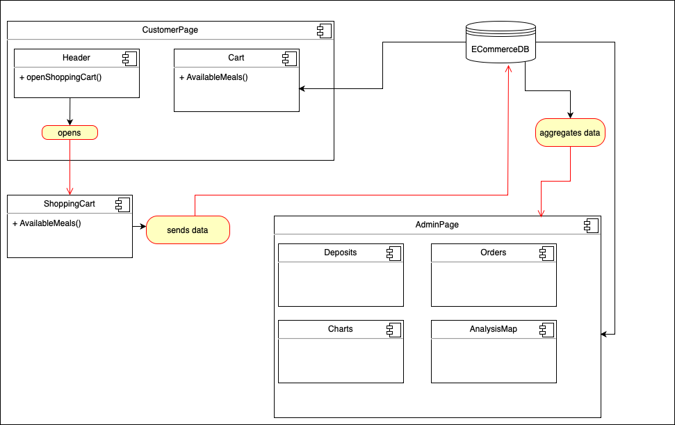
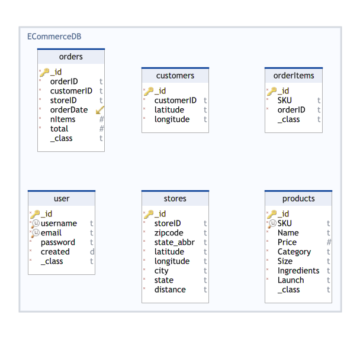
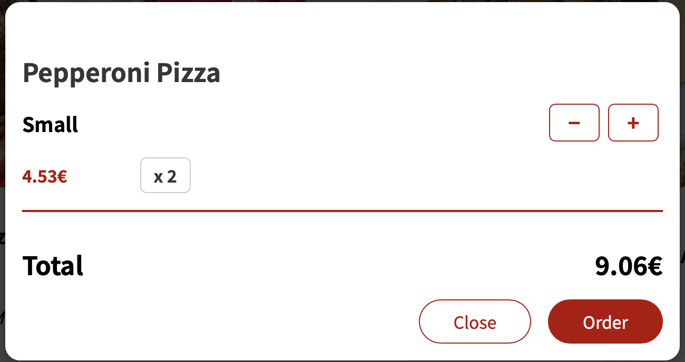
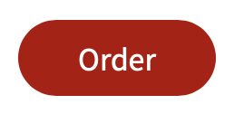

# **Advanced Programming - Customer Analysis**

## **Description of general approach**

This is a React-based e-commerce application that consists of two pages: the Customer Page and the Admin Page. On the Customer Page, users can view all products with all information like price and ingredients, add them to their shopping cart, and place orders. The orders are then sent to the backend for processing. On the Admin Page, users have the ability to analyze purchase behavior using various charts. Some of the displayed insights include the most purchased product by orders and the store with the highest revenue. Additionally, users can create a new product or the delete one.npm

## **UML diagram**



## **Database schema**



## **Description of the frontend and its capabilities**

The frontend of our application is built using React, a popular JavaScript library for building user interfaces. It serves as the client-side of the application, allowing users to interact with the system and access various features.

1. **View Products**

   Upon loading the customer page, users see a list of products that can be added to the shopping cart. You can either enter a number or increase/decrease the given number to add to the cart.

   

2. **Shopping Cart**

   By clicking on the shopping cart button, the a Cart Modal open. There you can see all added products and the total amount. In the Cart you can increase/decrease the number of products as well. Decreasing the number to 0 will delete the product from the cart. With the close button you can close the modal what will not reset the cart.

   

3. **Make Order**

   User that are satisfied with the chosen products in the cart can make the order by clicking on the order button. This will send the selected products and the total amount to the backend.

   

## **Installation & Maintenance Guideline**

### **Preconditions**

To run and use a React app on your computer, you need the following:

1. Node.js and npm (Node Package Manager):

   Node.js is a JavaScript runtime that allows you to execute JavaScript code outside of a web browser. npm is the default package manager for Node.js and is used to install and manage the dependencies required for your React app. You can download Node.js and npm from the official website: [node-js website](https://nodejs.org/)

2. Code Editor:

   You need a code editor to write and manage your React app's source code. There are various options available, including Visual Studio Code, Sublime Text, Atom, and WebStorm. Visual Studio Code is a popular choice for React development due to its rich features and extensive community support: [visual studio code website](https://code.visualstudio.com/)

### **Installation**

Open your terminal, follow these steps to install and run the frontend application:

1. Clone the repository:

```bash
git clone https://github.com/your-username/my-awesome-e-commerce-app.git
```

2. Navigate to the project directory:

```bash
cd /frontend
```

3. Install the dependencies:

```bash
npm install
```

4. Start the development server:

```bash
npm start
```

5. Open your browser and visit http://localhost:3000 to access the app.

## frameworks and libraries used

- React v18.2.0
- Leaflet v1.9.4
- recharts v2.6.2
- axios v1.3.4
- @mui/icons-material v5.11.11
- @mui/material v5.11.11

## Details how to change options like IP addresses and port numbers

tbd

## Other things which might help me

tbd

## Major Challenges

tbd

## Lessons Learned

### What would you make differently next time?

tbd

### What did you like / dislike about the frameworks & tools you were using?

tbd
